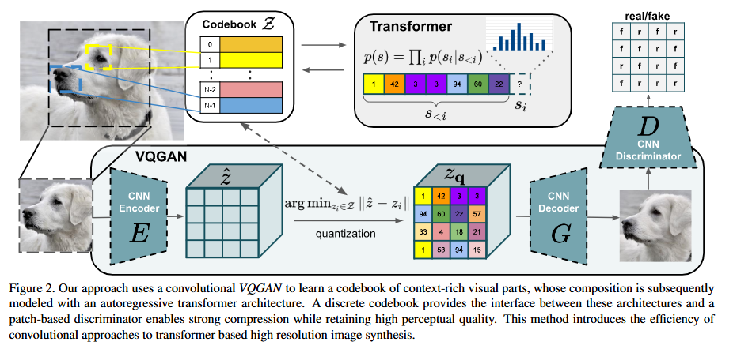
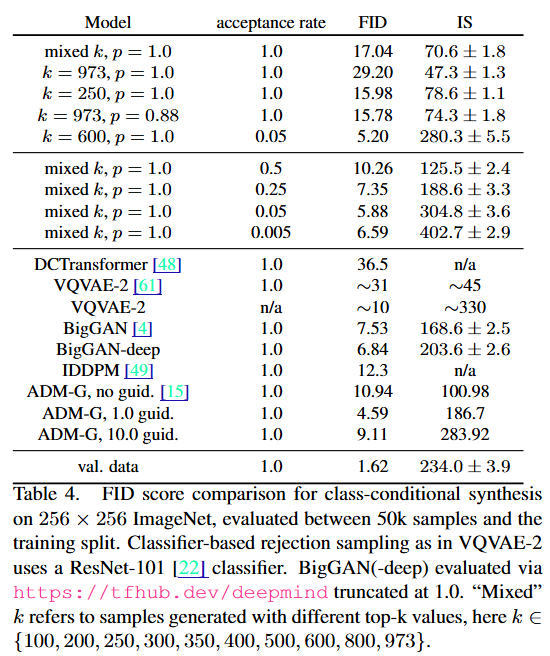
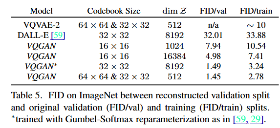
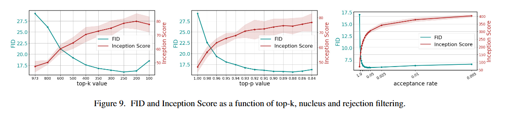

# Taming Transformers for High-Resolution Image Synthesis

This is an implementation of Taming Transformers for High-Resolution Image Synthesis

​The paper "Taming Transformers for High-Resolution Image Synthesis" introduces a novel framework that synergizes the efficiency of convolutional neural networks (CNNs) with the expressiveness of transformers to enable high-resolution image generation.

## Idea
Transformers, while powerful in modeling long-range dependencies, face computational challenges when applied directly to high-resolution images due to their quadratic complexity with sequence length. To address this, the authors propose a two-stage approach:​

- Vector Quantized Generative Adversarial Network (VQ-GAN): A CNN-based encoder-decoder architecture that compresses images into discrete latent representations (codebook entries), capturing essential visual features efficiently.​

- Transformer-based Autoregressive Model: A transformer that models the composition of these discrete tokens, enabling the generation of high-resolution images by predicting sequences of codebook entries.​

This combination allows the model to generate images with resolutions up to 1024×1024 pixels, outperforming previous autoregressive models in both quality and scalability. 

Key Components:

- VQ-GAN: Learns a codebook of context-rich visual parts, enabling efficient and meaningful compression of images into discrete tokens.​

- Transformer: Models the global composition of these tokens, capturing long-range dependencies and complex structures within images.​

- Adversarial Training: Incorporates a discriminator to enhance the perceptual quality of generated images, ensuring they are both realistic and high-fidelity.​

Performance Highlights:

- High-Resolution Generation: Achieves state-of-the-art results in generating high-resolution images, including semantically-guided synthesis of megapixel images. 

- Conditional Synthesis: Demonstrates versatility by effectively handling various conditional synthesis tasks, such as class-conditional generation and semantic layout-based synthesis.​

## Available Models

The following models are available with different configurations:

**Large (L) Models:**
- MaskGIT_L: embed_dim=1024, depth=16, num_heads=16, mlp_ratio=4, norm_layer=nn.LayerNorm

**Base (B) Models:**
- MaskGIT_B: embed_dim=768, depth=12, num_heads=12, mlp_ratio=4, norm_layer=nn.LayerNorm

**High (H) Models:**
- MaskGIT_H: embed_dim=1280, depth=20, num_heads=16, mlp_ratio=4, norm_layer=nn.LayerNorm

## Model Analysis & Results

### Generation Results

### AutoEncoder

### Filtering

## Citation
> **Taming Transformers for High-Resolution Image Synthesis**  
> *Patrick Esser, Robin Rombach, Björn Ommer*  
> arXiv 2021
> [[Paper]](https://arxiv.org/abs/2012.09841)

