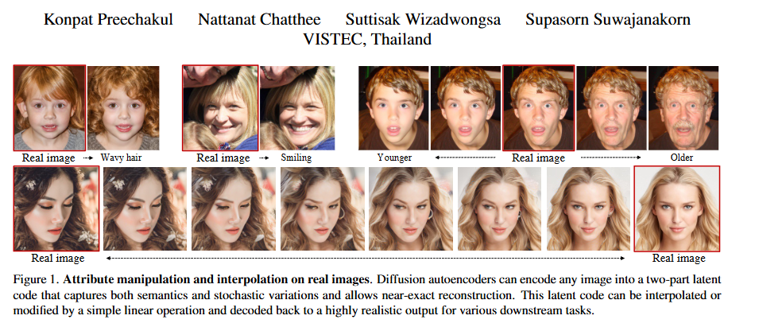
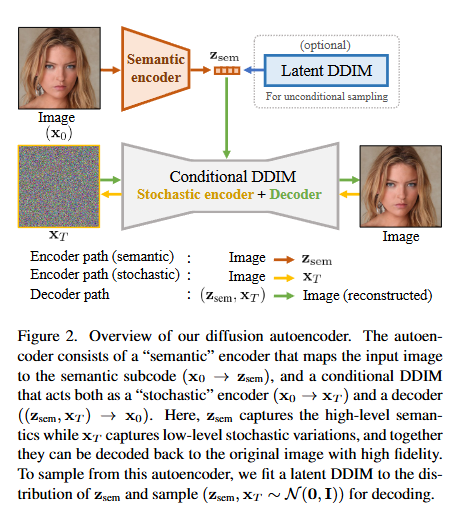
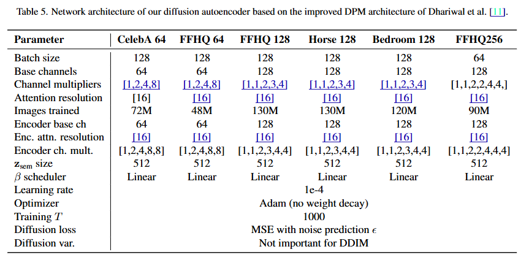
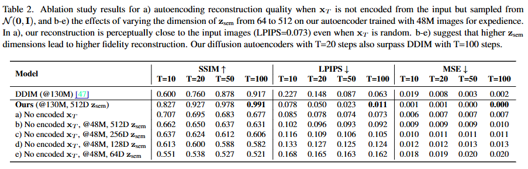
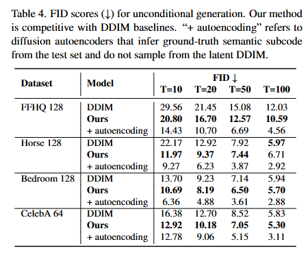

# Diffusion Autoencoders

This is an implementation of [Diffusion Autoencoders: Toward a Meaningful and Decodable Representation](https://arxiv.org/pdf/2111.15640).

## TODO: 
- [ ] Create inference pipeline for generation and manipulation
- [ ] Implement visualization tools for latent space
- [ ] Document usage and configuration options
- [ ] Encapsulate models for clear usage 

## Main Idea
Diffusion Autoencoders aim to learn a compressed latent representation of data while enabling high-quality generation through a diffusion process. The model integrates two key components:

- Autoencoder: Encodes high-dimensional data (e.g., images) into a lower-dimensional latent space, capturing essential features.

- Diffusion Model: Operates in the latent space to model the data distribution and generate samples by iteratively denoising.

By combining these components, DiffAEs achieve efficient generation in the latent space while maintaining the flexibility and quality associated with diffusion processes especially enabling fine grained control over the generation process

## Available Models

The following are available models as presented in the paper
- 

## Model Analysis & Results

### Architecture

### Semantic Space

### Unconditional Generation

## Citation
> **Diffusion Autoencoders: Toward a Meaningful and Decodable Representation**  
> *Konpat Preechakul, Nattanat Chatthee, Suttisak Wizadwongsa, Supasorn Suwajanakorn*  
> arXiv 2022  
> [[Paper]](https://arxiv.org/pdf/2111.15640)
