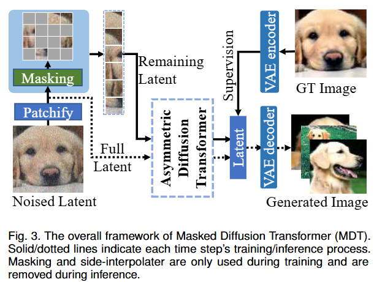
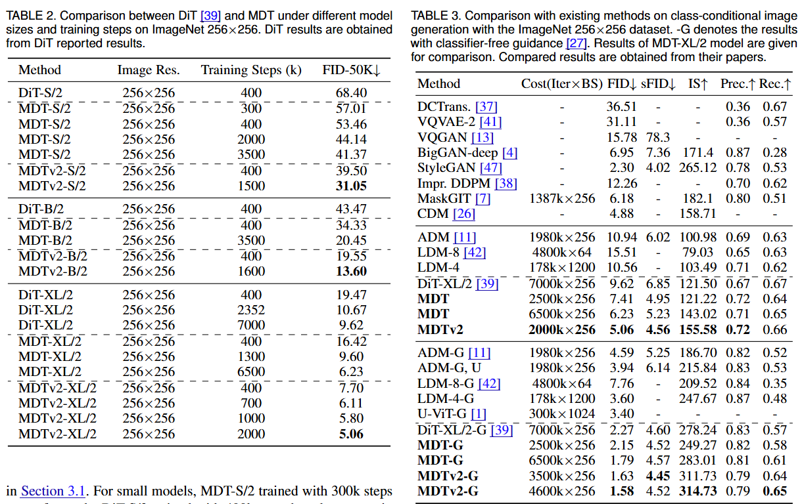

# MDTv2: Masked Diffusion Transformer is a Strong Image Synthesizer

This is an implementation of MDTv2: Masked Diffusion Transformer is a Strong Image Synthesizer

​The paper titled "MDTv2: Masked Diffusion Transformer is a Strong Image Synthesizer" introduces an innovative approach to enhance the efficiency and quality of image synthesis using diffusion models. The authors identify a key limitation in traditional diffusion probabilistic models (DPMs): a lack of contextual reasoning ability, which hampers their capacity to learn relationships among object parts within an image, leading to slower learning processes

## Idea
MDTv2 builds upon the Masked Diffusion Transformer (MDT) framework, which integrates a masked latent modeling scheme into the diffusion process. This approach involves masking certain tokens in the latent space during training, compelling the model to predict these masked tokens based on the unmasked ones. This strategy enhances the model's ability to understand and learn the contextual relationships between different parts of an image.

Key Components:

Asymmetric Diffusion Transformer Architecture: MDTv2 employs an asymmetric structure that focuses on predicting masked tokens from unmasked ones, reinforcing the model's contextual learning capabilities.​

Enhanced Network Structure: The model incorporates a macro network structure with U-Net-like long shortcuts in the encoder and dense input shortcuts in the decoder. These enhancements facilitate more efficient information flow and faster convergence during training.​

Improved Training Strategies: MDTv2 utilizes advanced training techniques, including the Adan optimizer, timestep-adapted loss weights, and a broader range of masking ratios (30%-5%), which collectively contribute to accelerated learning and improved performance.​

Performance Highlights:

State-of-the-Art Image Synthesis: MDTv2 achieves a new state-of-the-art Fréchet Inception Distance (FID) score of 1.58 on the ImageNet dataset, indicating superior image synthesis quality.​

Accelerated Training: The model demonstrates more than a 10× faster learning speed compared to the previous state-of-the-art DiT model, significantly reducing the computational resources and time required for training.​

Conclusion: MDTv2 represents a significant advancement in the field of image synthesis, addressing the contextual reasoning limitations of traditional diffusion models. By integrating masked latent modeling and architectural enhancements, MDTv2 not only improves the quality of generated images but also achieves remarkable efficiency in training.

## Available Models

The following MDTv2 models are available with different configurations:

**MDTv2_XL_2**: hidden_size=1152, depth=28, num_heads=16, patch_size=2
**MDTv2_L_2**: hidden_size=1024, depth=24, num_heads=16, patch_size=2
**MDTv2_B_2**: hidden_size=768, depth=12, num_heads=12, patch_size=2
**MDTv2_S_2**: hidden_size=384, depth=12, num_heads=6, patch_size=2

## Model Analysis & Results

### Generation Results

## Citation
> **MDTv2: Masked Diffusion Transformer is a Strong Image Synthesizer**  
> *Shanghua Gao, Pan Zhou, Ming-Ming Cheng, Shuicheng Yan*  
> arXiv 2023
> [[Paper]](https://arxiv.org/abs/2303.14389)

# Transformer Architectures for Diffusion Models

A comparison of three transformer-based architectures used in diffusion models: **DiT**, **UViT**, and **Masked Diffusion Transformer (MDT)**.

---

## 🧠 1. Core Architectural Philosophy

| Feature             | DiT                                  | UViT                                       | MDT                                             |
|---------------------|---------------------------------------|---------------------------------------------|--------------------------------------------------|
| Architecture        | Pure ViT (no U-Net hierarchy)         | U-Net with ViT-style transformer blocks      | Hybrid: Transformer with skip+masking            |
| Structure           | Flat transformer stack                | Symmetric encoder/decoder + mid block        | Encoder (in/out) + Decoder + side blocks         |
| Skip Connections    | ❌ None                               | ✅ Yes                                       | ✅ Yes (concat + linear projection)              |
| Mid Block           | ❌ None                               | ✅ Present                                   | ✅ Side blocks for interpolation                 |

---

## 🔲 2. Patch Embedding & Positional Encoding

| Feature              | DiT                                | UViT                                    | MDT                                               |
|----------------------|-------------------------------------|------------------------------------------|----------------------------------------------------|
| Patchify             | `PatchEmbed` with linear proj       | Same (`PatchEmbed`)                      | Same (`PatchEmbed`)                               |
| Positional Encoding  | ✅ Sinusoidal (non-trainable)       | ✅ Learnable (`pos_embed`)               | ✅ Learnable, sin-cos initialized (`pos_embed`)    |

---

## 🧠 3. Conditioning (Time + Class)

| Feature                | DiT                                          | UViT                                       | MDT                                                  |
|------------------------|-----------------------------------------------|---------------------------------------------|-------------------------------------------------------|
| Time Conditioning      | MLP + AdaLN                                   | Injected as a token (`time_token`)          | MLP + AdaLN-Zero                                     |
| Class Conditioning     | Added to `t` as `c = t + y`                   | Extra token (`label_emb`)                   | Added to `t` as `c = t + y`                          |
| Class-Free Guidance    | ✅ `forward_with_cfg()` available             | ❌ Not implemented                           | ✅ Implemented with advanced scaling (`scale_pow`)    |

---

## 🧱 4. Transformer Blocks

| Feature            | DiT                             | UViT                                     | MDT                                                    |
|--------------------|----------------------------------|-------------------------------------------|---------------------------------------------------------|
| Block Type         | `DiTBlock` with AdaLN            | `Block` with optional skip                | `MDTBlock` with AdaLN-Zero + optional skip             |
| Block Layout       | Uniform stack                    | Encoder → Mid block → Decoder             | Encoder (in/out blocks) + decoder + sideblock          |
| Attention Scope    | Global attention                 | Global attention + skip residuals         | Global attention + optional masking interpolation       |

---

## 🎭 5. Masking / Interpolation

| Feature               | DiT              | UViT              | MDT                                                      |
|-----------------------|------------------|--------------------|-----------------------------------------------------------|
| Masking Support       | ❌ None           | ❌ None             | ✅ Yes (random masking with restoration)                  |
| Mask Token            | ❌ Not used       | ❌ Not used         | ✅ Learnable mask token                                   |
| Side Interpolator     | ❌ N/A            | ❌ N/A              | ✅ Uses `sideblocks` for interpolation post-masking       |

---

## 🧩 6. Decoder & Output

| Feature             | DiT                                         | UViT                                         | MDT                                                      |
|---------------------|----------------------------------------------|-----------------------------------------------|-----------------------------------------------------------|
| Output Channels     | `in_channels` or `in_channels * 2`          | Matches input channels                        | `in_channels` or `in_channels * 2` depending on sigma     |
| Decoder             | Final linear layer + `unpatchify()`         | `decoder_pred` + `unpatchify()` + conv opt    | `FinalLayer` with AdaLN-Zero + `unpatchify()`            |
| Output Shape        | Reshaped based on patch size                | Similar                                       | Reshaped using learned patch size                         |

---

## 🧪 7. Training & Initialization

| Feature                   | DiT                                        | UViT                                          | MDT                                                      |
|---------------------------|---------------------------------------------|------------------------------------------------|-----------------------------------------------------------|
| Weight Initialization     | `xavier_uniform_`, AdaLN special init       | Mostly `normal_`, standard layernorm           | Extensive: sin-cos pos init, AdaLN-Zero zeroed layers     |
| Positional Embedding Init | Frozen sine-cosine                         | Learnable, random                             | Learnable, sin-cos initialized                            |
