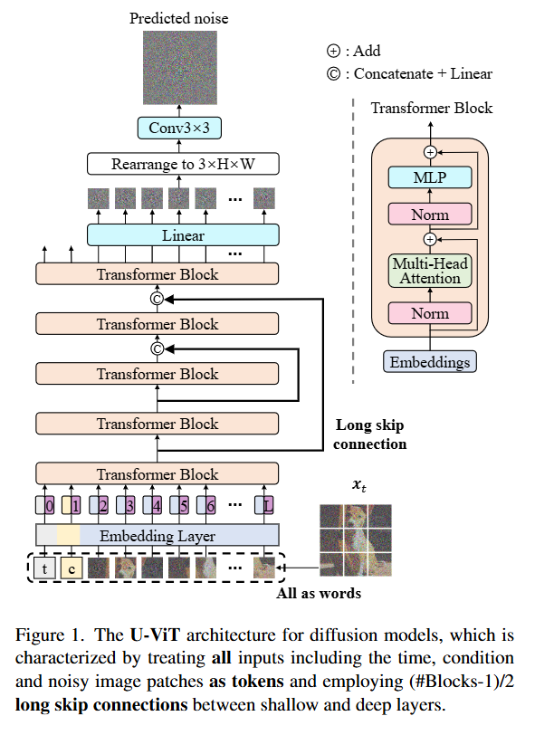
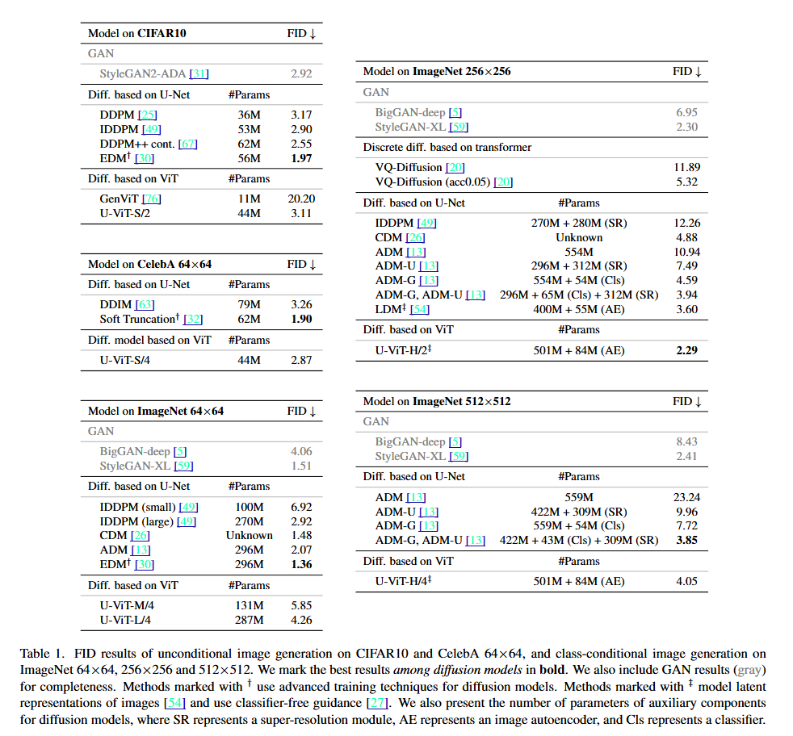
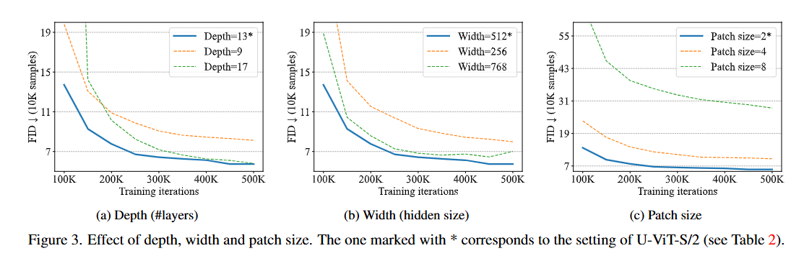
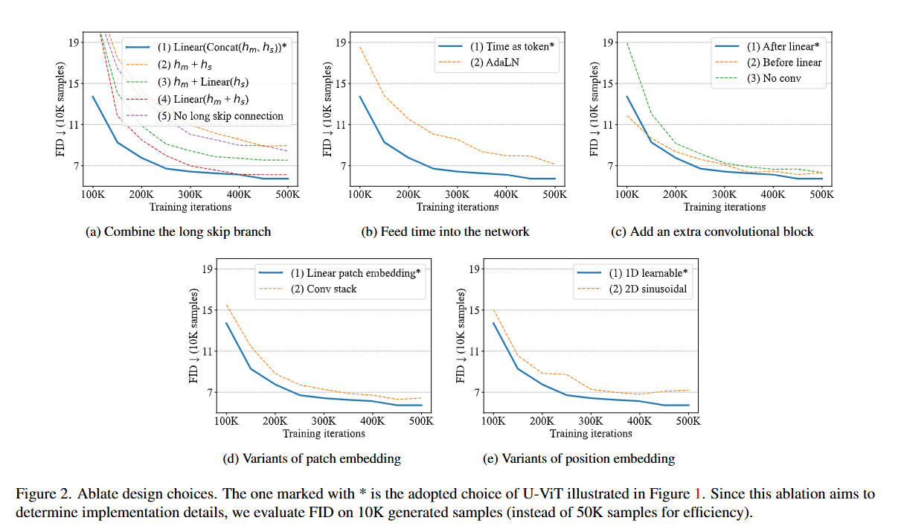

# All are Worth Words: A ViT Backbone for Diffusion Models

This is an implementation of All are Worth Words: A ViT Backbone for Diffusion Models

The paper titled "All are Worth Words: A ViT Backbone for Diffusion Models" introduces U-ViT, a Vision Transformer (ViT)-based architecture designed to serve as an effective backbone for diffusion models in image generation tasks. Traditionally, convolutional neural networks (CNNs), particularly U-Net architectures, have been the standard choice for such models. This work explores the potential of transformers in this domain, aiming to leverage their strengths in modeling long-range dependencies.​

## Idea
U-ViT treats all inputs—including time steps, conditioning information, and noisy image patches—as tokens, allowing the transformer to process them uniformly. A key innovation is the incorporation of long skip connections between shallow and deep layers, inspired by the U-Net architecture. These connections help preserve low-level features crucial for accurate image reconstruction in diffusion models.​

Key Components:

- Tokenization of Inputs: All relevant information (time, condition, noisy image patches) is embedded as tokens, enabling the transformer to handle diverse inputs cohesively.​

- Long Skip Connections: By connecting early and later layers, the model retains essential low-level details, improving the fidelity of generated images.​

- Optional Convolutional Output Layer: A 3×3 convolutional block is added before the output to mitigate potential artifacts and enhance visual quality.​

Performance Highlights:

- Class-Conditional Image Generation: Achieved a Fréchet Inception Distance (FID) score of 2.29 on ImageNet 256×256, surpassing previous models without relying on large external datasets.​

- Text-to-Image Generation: Attained an FID score of 5.48 on the MS-COCO dataset, demonstrating the model's versatility across different generation tasks.​

- Efficiency: U-ViT matches or exceeds the performance of similarly sized CNN-based U-Nets while maintaining comparable computational costs.

In summary, U-ViT demonstrates that Vision Transformers, when equipped with appropriate architectural features like long skip connections, can serve as powerful backbones for diffusion models, offering competitive performance and efficiency in high-quality image synthesis tasks.

## Available Models

The following U-ViT models are available with different configurations:

**U_ViT_Small**: embed_dim=512, depth=13, num_heads=8
**U_ViT_Small_Deep**: embed_dim=512, depth=17, num_heads=8
**U_ViT_Mid**: embed_dim=768, depth=17, num_heads=12
**U_ViT_Large**: embed_dim=1024, depth=21, num_heads=16
**U_ViT_Huge**: embed_dim=1152, depth=29, num_heads=16

## Model Analysis & Results

### Generation Results

### Versions

### Embeddings

## Citation
> **All are Worth Words: A ViT Backbone for Diffusion Models**  
> *Fan Bao, Shen Nie, Kaiwen Xue, Yue Cao, Chongxuan Li, Hang Su, Jun Zhu*  
> arXiv 2023
> [[Paper]](https://arxiv.org/abs/2209.12152)

# Transformer Architectures for Diffusion Models

A comparison of three transformer-based architectures used in diffusion models: **DiT**, **UViT**, and **Masked Diffusion Transformer (MDT)**.

---

## 🧠 1. Core Architectural Philosophy

| Feature             | DiT                                  | UViT                                       | MDT                                             |
|---------------------|---------------------------------------|---------------------------------------------|--------------------------------------------------|
| Architecture        | Pure ViT (no U-Net hierarchy)         | U-Net with ViT-style transformer blocks      | Hybrid: Transformer with skip+masking            |
| Structure           | Flat transformer stack                | Symmetric encoder/decoder + mid block        | Encoder (in/out) + Decoder + side blocks         |
| Skip Connections    | ❌ None                               | ✅ Yes                                       | ✅ Yes (concat + linear projection)              |
| Mid Block           | ❌ None                               | ✅ Present                                   | ✅ Side blocks for interpolation                 |

---

## 🔲 2. Patch Embedding & Positional Encoding

| Feature              | DiT                                | UViT                                    | MDT                                               |
|----------------------|-------------------------------------|------------------------------------------|----------------------------------------------------|
| Patchify             | `PatchEmbed` with linear proj       | Same (`PatchEmbed`)                      | Same (`PatchEmbed`)                               |
| Positional Encoding  | ✅ Sinusoidal (non-trainable)       | ✅ Learnable (`pos_embed`)               | ✅ Learnable, sin-cos initialized (`pos_embed`)    |

---

## 🧠 3. Conditioning (Time + Class)

| Feature                | DiT                                          | UViT                                       | MDT                                                  |
|------------------------|-----------------------------------------------|---------------------------------------------|-------------------------------------------------------|
| Time Conditioning      | MLP + AdaLN                                   | Injected as a token (`time_token`)          | MLP + AdaLN-Zero                                     |
| Class Conditioning     | Added to `t` as `c = t + y`                   | Extra token (`label_emb`)                   | Added to `t` as `c = t + y`                          |
| Class-Free Guidance    | ✅ `forward_with_cfg()` available             | ❌ Not implemented                           | ✅ Implemented with advanced scaling (`scale_pow`)    |

---

## 🧱 4. Transformer Blocks

| Feature            | DiT                             | UViT                                     | MDT                                                    |
|--------------------|----------------------------------|-------------------------------------------|---------------------------------------------------------|
| Block Type         | `DiTBlock` with AdaLN            | `Block` with optional skip                | `MDTBlock` with AdaLN-Zero + optional skip             |
| Block Layout       | Uniform stack                    | Encoder → Mid block → Decoder             | Encoder (in/out blocks) + decoder + sideblock          |
| Attention Scope    | Global attention                 | Global attention + skip residuals         | Global attention + optional masking interpolation       |

---

## 🎭 5. Masking / Interpolation

| Feature               | DiT              | UViT              | MDT                                                      |
|-----------------------|------------------|--------------------|-----------------------------------------------------------|
| Masking Support       | ❌ None           | ❌ None             | ✅ Yes (random masking with restoration)                  |
| Mask Token            | ❌ Not used       | ❌ Not used         | ✅ Learnable mask token                                   |
| Side Interpolator     | ❌ N/A            | ❌ N/A              | ✅ Uses `sideblocks` for interpolation post-masking       |

---

## 🧩 6. Decoder & Output

| Feature             | DiT                                         | UViT                                         | MDT                                                      |
|---------------------|----------------------------------------------|-----------------------------------------------|-----------------------------------------------------------|
| Output Channels     | `in_channels` or `in_channels * 2`          | Matches input channels                        | `in_channels` or `in_channels * 2` depending on sigma     |
| Decoder             | Final linear layer + `unpatchify()`         | `decoder_pred` + `unpatchify()` + conv opt    | `FinalLayer` with AdaLN-Zero + `unpatchify()`            |
| Output Shape        | Reshaped based on patch size                | Similar                                       | Reshaped using learned patch size                         |

---

## 🧪 7. Training & Initialization

| Feature                   | DiT                                        | UViT                                          | MDT                                                      |
|---------------------------|---------------------------------------------|------------------------------------------------|-----------------------------------------------------------|
| Weight Initialization     | `xavier_uniform_`, AdaLN special init       | Mostly `normal_`, standard layernorm           | Extensive: sin-cos pos init, AdaLN-Zero zeroed layers     |
| Positional Embedding Init | Frozen sine-cosine                         | Learnable, random                             | Learnable, sin-cos initialized                            |
